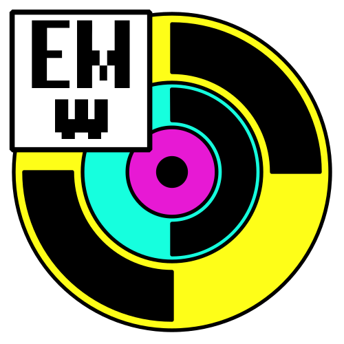

  

  
  
  
  
   
  <h1 align="center">EMWave</h1>
  <h3>Python-библиотека для моделирования волновых процессов</h3>

# EMWave

EMWave — это Python библиотека для **численного расчёта и временного моделирования** различных физических полей (электромагнитных, потенциальных и других). Проект также предоставляет инструменты для **визуализации** полученных результатов.

На текущий момент реализован базовый функционал для работы с полями. По мере развития проекта планируется расширение возможностей, добавление новых типов полей и методов расчёта.

<!-- ## Визуализации

  <td align="center">
          
           
  </td>

  <td align="center">
          
           
  </td>

 -->

## 📄 Лицензия

Данный проект распространяется под лицензией **BSD 3-Clause**.  
Подробнее см. в файле [LICENSE](LICENSE).

---
© 2026 Бухтуев Денис Андреевич